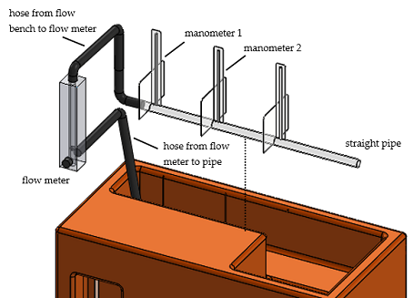
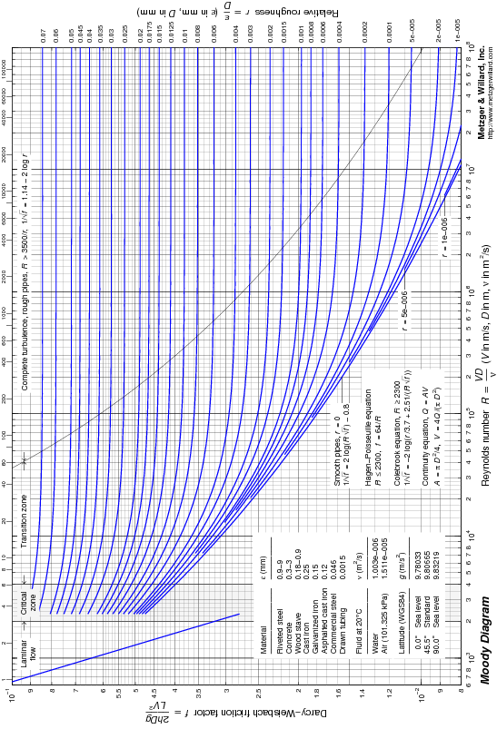

```{r setup, include=FALSE}
knitr::opts_chunk$set(echo = TRUE,
                      message = FALSE,
                      warning = FALSE)
library(tidyverse)
library(captioner)
```

```{r echo=FALSE}
table_id <- captioner(prefix="Table")
figure_id <- captioner(prefix = "Figure")
```

## Introduction

To partially fulfill our course requirements, we planned and conducted an experiment to determine the friction factor of a straight PVC pipe. The apparatus is an Armfield flow bench instrumented for measuring pressure and flow rate. The experiment findings are compared to published values in a Moody chart. Results within 30% of expected values are considered successful.

## Apparatus

```{r, echo=FALSE, results='hide'}
figure_id(name = "fig_1", caption = "Configuration of the flow bench.")
```

The apparatus is an Armfield flow bnech instrumented as illustrated in `r figure_id("fig_1", display = "cite")`. The flow bench has an adjustable flow pump that cycles water from a reservoir through the straight pipe and back to the reservoir. The pump speed is adjusted each trial to obtain a desired flow rate measured by a flow meter.

###### 
###### `r figure_id("fig_1")` 

Attached to the pipe are three manometers distanced at 20 cm apart for measuring fluid pressure at that point. Only two of the manometers are used.

## Modeling

For an incompressible fluid (in this experiment, water at room temperature) the pressure difference $\Delta{p}$ between two points along a straight pipe is modeled by the Darcy-Weisbach equation [@gerhart],

$$\Delta{p} = f\frac{L}{D}\frac{1}{2}\rho v^2,$$ (1)

```{r, echo=FALSE, results='hide'}
figure_id(name = "fig_2", caption = "Illustrating the variables that appear in the data reduction equation.")
```

where $L$ is the pipe length of the pipe, $D$ is the pipe inner diameter, $v$ is the fluid velocity, and $f$ is the friction factor, illustrated in `r figure_id("fig_2", display = "cite")`. Determining the friction factor is the goal of the experiment.

###### 
###### `r figure_id("fig_2")` 

From hydrostatics, pressure at the base of each manometer is given by

$$p = \rho gh,$$ (2)

where $\rho$ is the fluid density and $h$ is the measured manometer fluid height. The pressure difference, therefore, is given by

$$\Delta{p} = \rho g(h_1-h_2).$$ (3)

Substituting (3) into (1) and rearranging, we obtain an expression for the friction factor,

$$f = \frac{2Dg(h_1-h_2)}{Lv^2}.$$ (4)

Flow rate is the product of fluid velocity and pipe cross-sectional area A, thus, velocity can be written,

$$v = \frac{\overset{.}{V}}{A}$$ (5)

where $\overset{.}{V}$ is measured flow rate and area $A$ of a circular pipe is $\pi D^2/4$. Substituting (5) and the area expression into (4) yields the data reduction equation,

$$f = \frac{\pi^2D^5g(h_1-h_2)}{8L\overset{.}{V^2}}.$$ (6)

To compare our experimental results to the published values in a Moody chart, we compute the Reynolds number for each operating condition, given by,

$$Re = \frac{\rho vD}{\mu},$$ (7)

where $\nu$ is the dynamic viscosity of the fluid, a table look-up value for water at room temperature. Substituting for velocity, we obtain Reynolds number in terms of the measurands,

$$Re = \frac{4\rho\overset{.}{V}}{\pi\mu D}.$$ (8)

## Procedure

Several one-time measurements and table look-ups are made. Measurements are made of the $D$ (using calipers) and $L$ (using a tape measure). Reference look-up values are obtained for PVC pipe roughness and water density and viscosity at room temperature [@toolbox].

The test sequence is based on ten trials of three operating conditions. The operating conditions are a low, medium, and high flow rate (determined by the range of pump speeds available that produce steady flow rates). In this case, the three flow rates are approximately 1.5, 2.5, and 3.5 gallons per minute. Ten observations are planned for each flow rate and the test sequence is randomized.

```{r, echo=FALSE, results='hide'}
figure_id(name = "fig_3", caption = "Elements of the apparatus important for the procedure.")
```

As shown in `r figure_id("fig_3", display = "cite")`, for each observation, the motor speed is adjusted until the flow rate measurement indicates steady flow at the desired flow rate. Manometer readings for that observation are recorded.

###### 
###### `r figure_id("fig_3")` 

## Data

```{r echo=FALSE, results='hide'}
table_id(name="tbl_1", caption="Complete experimental data.")
```

The thirty observations are shown in `r table_id("tbl_1", display = "cite")`. The data have been organized by flow rate. The flow is measured in gpm and $h_1$ and $h_2$ are measured in mm.

```{r, echo=FALSE}
data <- read.csv("../data/complete-experimental-data.csv")
colnames(data) <- c("Flow", "$h_1$", "$h_2$", "Flow", "$h_1$", "$h_2$", "Flow", "$h_1$", "$h_2$")
data <- data[-1,]
rownames(data) <- NULL
knitr::kable(data, caption = table_id("tbl_1"))
```

```{r echo=FALSE, results='hide'}
table_id(name="tbl_2", caption="Constants and one-time measurands.")
```

`r table_id("tbl_2", display = "cite")` lists the physical constants and one-time measurands. Values that may be uncertain are the pipe roughness and dynamic viscosity.

```{r, echo=FALSE}
options(scipen = 999)
data <- read_csv("../data/constants.csv")
knitr::kable(data, caption = table_id("tbl_2"))
```

The range for the surface roughness is 0.0015 to 0.007 mm, therefore we did not have an exact roughness value for our specific experimental PVC pipe.

## Analysis

For a given flow rate, a Thompson tau test [@thompson] is performed to identify potential outliers. The test is repeated for each flow rate.

For every trial, friction factor (6) and Reynolds number (8) are computed. At each of the three operating conditions (low, medium, and high flow rate) a mean friction factor and mean Reynolds number are determined.

These three mean values are graphed on a conventional Moody chart for comparison to expected values and a percent difference from expected values is determined.

Total uncertainty of the friction factor is given by

$$u_f^2 = u_{f,sys}^2 + u_{f,rand}^2,$$ (9)

comprised of systematic and random components. Because each operating condition is assumed to be at steady state, random uncertainty is computed in either resultant. Systematic uncertainty is estimated by applying uncertainty propagation to the data reduction equation (6), yielding,

$$u_{f,sys}^2 = a_{h_1}^2u_{h_1,sys}^2 + a_{D}^2u_{D,sys}^2 + a_{L}^2u_{L,sys}^2 + a_{\overset{.}{V}}^2u_{\overset{.}{V},sys}^2,$$ (10)

where $a$ is the sensitivity coefficient and $u_{sys}$ is the systematic uncertainty in each measurand due to sensor accuracy and readability.

Total uncertainty in Reynolds number is estimated in a similar manner.

## Results

The outlier tests indicate that no data were potential outliers, therefore, all data in `r table_id("tbl_1", display = "cite")` were used in the analysis.

```{r echo=FALSE, results='hide'}
table_id(name="tbl_3", caption="Mean friction factor and Reynolds number at three operating conditions.")
```

Average results for friction factor and Reynolds number at each operating condition are shown in `r table_id("tbl_3", display = "cite")`.

```{r echo=FALSE}
data <- read_csv("../results/mean-fricfac-reynum.csv")
knitr::kable(data, caption = table_id("tbl_3"))
```

<br>

----- I fixed nu to mu and my friction fractor is still high by two orders of magnitude, what should I do?

<br>

We see that the lower flow rates yield lower Reynolds numbers and higher friction factors, consistent with expectations from the Moody chart.

```{r, echo=FALSE, results='hide'}
figure_id(name = "fig_4", caption = "Resultants for low, medium, and high flow rates graphed on a Moody diagram.")
```

These values are graphed on the Moody chart in `r figure_id("fig_4", display = "cite")` [@davis]. To assist in the visual comparison, the experimental data are drawn with circles and the expected values are shown as triange data markers.

```{r echo=FALSE, results='hide'}
table_id(name="tbl_4", caption="Friction factor comparison.")
```

Overall, the experimental friction factors are higher than expected. The percent difference is shown in `r table_id("tbl_4", display = "cite")`. All values are within 30% of the expected values.

```{r echo=FALSE}
data <- read_csv("../results/percent-diff.csv")
knitr::kable(data, caption = table_id("tbl_4"))
```

###### 
###### `r figure_id("fig_4")` 

## Conclusion

The goal of this experiment was to determine friction factor of a straight pipe. That goal was achieved for three flow rates. Percent differences to expected values are within 30% and relative uncertainties are within 30%. Both are acceptable norms for experiments of this type.

The discrepancies in our results could have been caused by unstable water flow from the flow bench. Unstable flow will make the height of the manometer unstable and hard to read an accurate number.

## References
